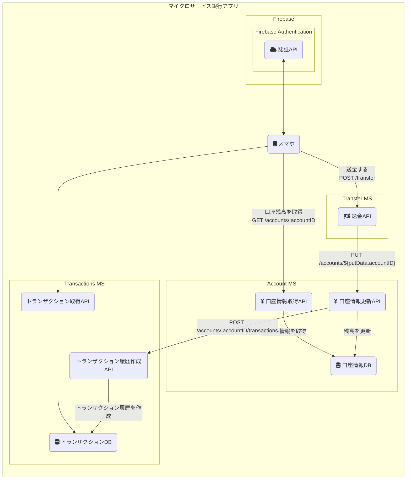

# ms-bank

マイクロサービス銀行アプリ

## フローチャート

```mermaid
graph LR
  subgraph ms_bank[マイクロサービス銀行アプリ]
    phone(fa:fa-mobile スマホ)
      subgraph firebasep[Firebase]
        subgraph firebase_authentication[Firebase Authentication]
          auth_api(fa:fa-cloud 認証API)
        end
      end
      subgraph account_ms[Account MS]
        get_account(fa:fa-yen-sign 口座情報取得API)
        put_account(fa:fa-yen-sign 口座情報更新API)
        db_account(fa:fa-database 口座情報DB)
      end
      subgraph transfer_ms[Transfer MS]
        post_transfer(fa:fa-money-bill-transfer 送金API)
      end
      subgraph transactions_ms[Transactions MS]
        get_transactions(トランザクション取得API)
        create_transactions(トランザクション履歴作成API)
        db_transactions(fa:fa-database トランザクションDB)
      end
  end


%% 認証
auth_api <---> phone

%% 口座情報取得
phone --口座残高を取得<br> GET /accounts/:accountID --> get_account
get_account --DBから情報を取得--> db_account

%% トランザクション取得
phone ---> get_transactions
get_transactions ---> db_transactions


%% 送金
phone --送金する<br> POST /transfer --> post_transfer
post_transfer --PUT /accounts/${putData.accountID}--> put_account
put_account --残高を更新--> db_account
put_account --POST /accounts/:accountID/transactions--> create_transactions
create_transactions --トランザクション履歴を作成--> db_transactions
```
