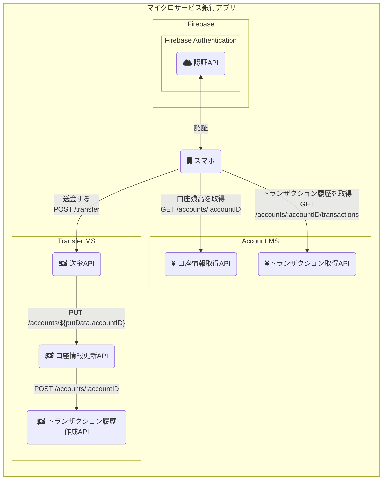

# ms-bank

マイクロサービス銀行アプリ

## フローチャート

```mermaid
graph LR
    subgraph ms_bank[マイクロサービス銀行アプリ]
        phone(fa:fa-mobile スマホ)
                subgraph firebasep[Firebase]
                    subgraph firebase_authentication[Firebase Authentication]
                        auth_api(fa:fa-cloud 認証API)
                    end
                end
                subgraph account_ms[Account MS]
                    get_account(fa:fa-yen-sign 口座情報取得API)
                    get_transactions(fa:fa-yen-signトランザクション取得API)
                end
                subgraph transfer_ms[Transfer MS]
                    post_transfer(fa:fa-money-bill-transfer 送金API)
                    put_account(fa:fa-money-bill-transfer 口座情報更新API)
                    create_transactions(fa:fa-money-bill-transfer トランザクション履歴作成API)
                end
    end

auth_api <--認証--> phone
phone --口座残高を取得<br> GET /accounts/:accountID --> get_account
phone --トランザクション履歴を取得<br> GET /accounts/:accountID/transactions--> get_transactions

phone --送金する<br> POST /transfer --> post_transfer
post_transfer --PUT /accounts/${putData.accountID}--> put_account
put_account --POST /accounts/:accountID --> create_transactions
```
