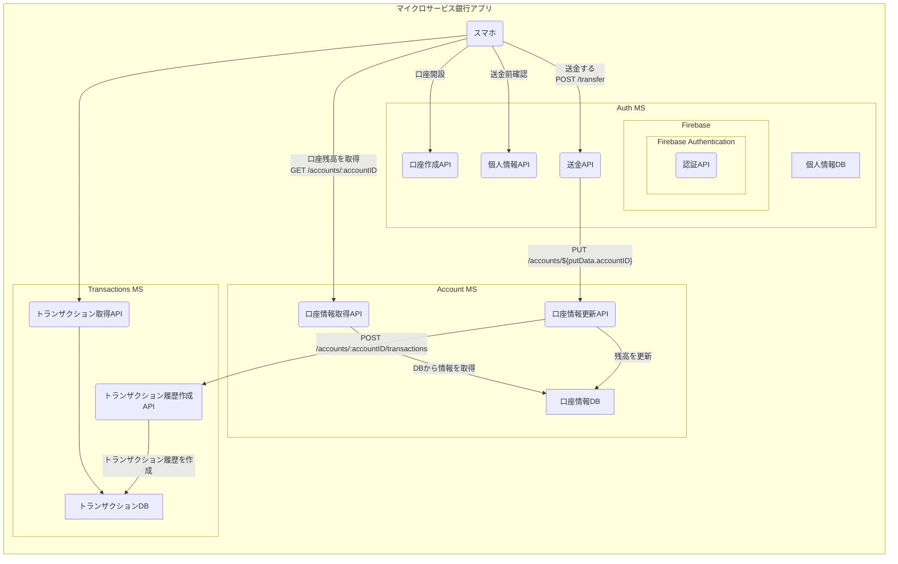
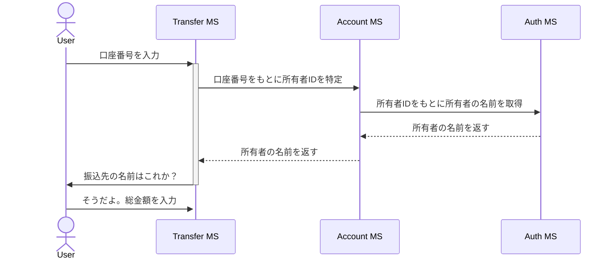
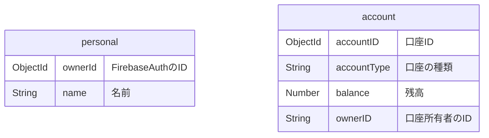

# ms-bank

マイクロサービス銀行アプリ

## フローチャート

```mermaid
graph LR
  subgraph ms_bank[マイクロサービス銀行アプリ]
    phone(スマホ)
      subgraph transfer_ms[Auth MS]
        register(口座作成API)
        get_personal_info_api(個人情報API)
        db_personal[個人情報DB]
        subgraph firebasep[Firebase]
          subgraph firebase_authentication[Firebase Authentication]
            auth_api(認証API)
          end
        end
      end
      subgraph account_ms[Account MS]
        get_account_api(口座情報取得API)
        put_account_api(口座情報更新API)
        db_account[口座情報DB]
      end
      subgraph transfer_ms[Transfer MS]
        post_transfer_api(送金API)
      end
      subgraph transactions_ms[Transactions MS]
        get_transactions_api(トランザクション取得API)
        post_transactions_api(トランザクション履歴作成API)
        db_transactions[トランザクションDB]
      end
  end


%% 口座開設
phone --口座開設--> register

%% 口座情報取得
phone --口座残高を取得<br> GET /accounts/:accountID --> get_account_api
get_account_api --DBから情報を取得--> db_account

%% トランザクション取得
phone ---> get_transactions_api
get_transactions_api ---> db_transactions

%% アカウント名を取得
phone --送金前確認--> get_personal_info_api

%% 送金
phone --送金する<br> POST /transfer --> post_transfer_api
post_transfer_api --PUT /accounts/${putData.accountID}--> put_account_api
put_account_api --残高を更新--> db_account
put_account_api --POST /accounts/:accountID/transactions--> post_transactions_api
post_transactions_api --トランザクション履歴を作成--> db_transactions
```

### 送金するとき

```mermaid
sequenceDiagram
  actor U as User
  participant transfer_ms as Transfer MS
  participant account_ms as Account MS
  participant auth_ms as Auth MS

  U->>+transfer_ms: 口座番号を入力
  transfer_ms->>account_ms: 口座番号をもとに所有者IDを特定
  account_ms->>auth_ms:所有者IDをもとに所有者の名前を取得
  auth_ms-->>account_ms: 所有者の名前を返す
  account_ms-->>transfer_ms: 所有者の名前を返す
  transfer_ms->>-U: 振込先の名前はこれか？

  U->>+transfer_ms: そうだよ。総金額を入力
```

## DB 設計

ドキュメント型の DB であるが、ER 図の使用上 RDB っぽい書き方である

```mermaid
erDiagram
personal {
  ObjectId ownerId "FirebaseAuthのID"
  String name "名前"
}

account {
  ObjectId accountID "口座ID"
  String accountType "口座の種類"
  Number balance "残高"
  String ownerID "口座所有者のID"
}


```
